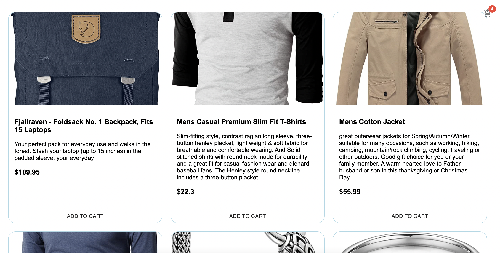
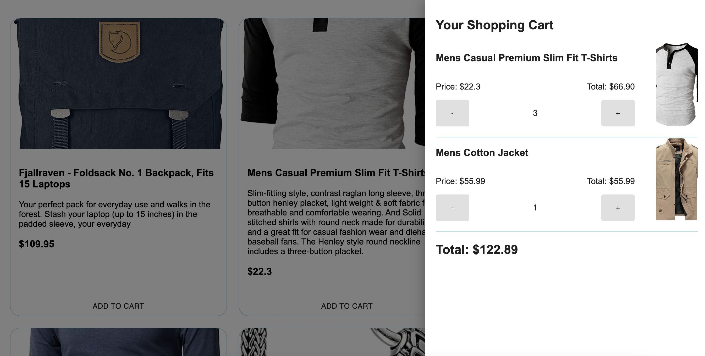

#### Shopping cart with React/TypeScript

#### [tutorial>>>](https://www.youtube.com/watch?v=7NqeSf1c-bw)

#### [see project](https://sweta-react-ts-shopping-cart.netlify.app)

- Simple shopping cart home page. It uses Fake store API to load some random products on the home page, which have add to cart button. It has a shopping cart functionality with add/subtract item +/- buttons and total sum button. The app uses material-ui for easier components styling.
- Libraries and API
  - material-ui
  - styled-components
  - react-query
  - [Fake store API](https://fakestoreapi.com)

###### For Netlify upload

- in package.json => in "scripts": => "build": "CI= react-scripts build"
- in public => create new file \_redirects and inside: /\* /index.html 200

#### Challenges

- To add TypeScript to an existing Create React App project
  - first install it: npm install --save typescript @types/node @types/react @types/react-dom @types/jest
  - Next, rename any file to be a TypeScript file (e.g. src/index.js to src/index.tsx) and restart your development server!
- Error "Cannot use JSX unless the '--jsx' flag is provided"
  - Adding "jsx": "preserve" to tsconfig.json will bypass the warning

    

 

    

 
